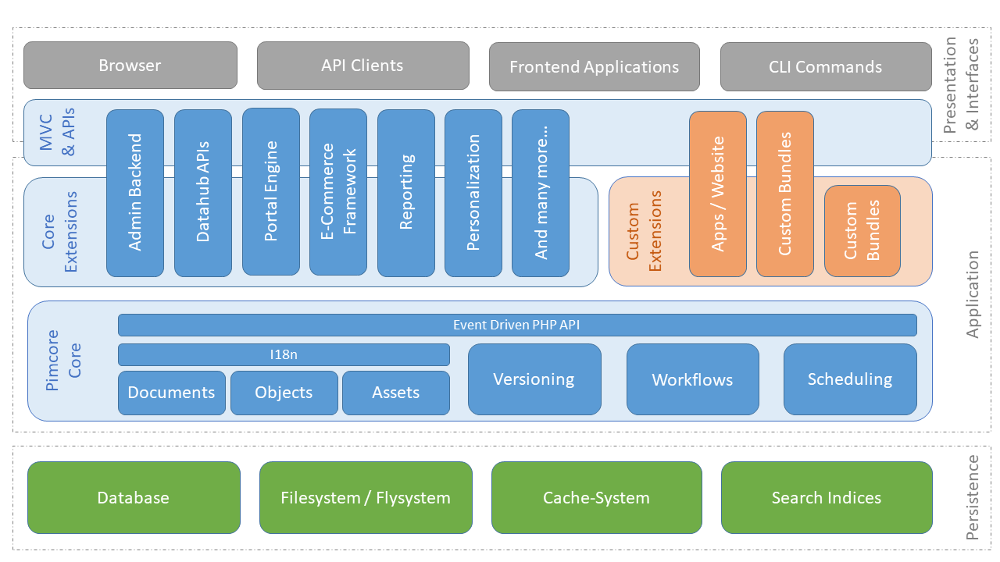

# Architecture Overview

At this point we want to give a short overview of the architecture of OpenDXP. 

As usual, a picture is worth a thousand words: 
 

This chart shows the architecture of a typical OpenDXP application. Everything in blue is shipped directly with OpenDXP, is an integral part of it, or is an extension of its Core that can be installed depending on the project's needs. The other components are printed in different colors.

OpenDXP itself consists of the OpenDXP Core and the MVC component. 
The OpenDXP Core is the main application, which provides all the basic functionalities and can be started within the MVC component or in a headless way, for example via CLI scripts.
The OpenDXP Core is also responsible for accessing the persistence layer with Database, Filesystem and Cache-System. 

Built upon the OpenDXP Core, the MVC component provides all the necessary 
functionalities for interacting with OpenDXP via the Browser or any other HTTP
API client (REST, SOAP, ...).

The Core extensions can be installed via Composer, extending the Core functionalities with additional functions. Some of them are only provided by the Enterprise Edition.
 
Plugins and other custom modules/bundles can also be added via Composer and use the OpenDXP Core functionalities via its API, or be used by the MVC component. 

When implementing solutions with OpenDXP, your custom parts should be in one of the following locations within the architecture: 

 * Apps/Website within the MVC component: Here are all the solution specific implementations 
 like models, views and controllers for your website. 
 * Plugins/Bundles, custom modules: Here are all implementations and modules you might want to reuse 
 in other projects. Like in other solutions out there, it's not mandatory to make a plugin out of every piece of code. 
