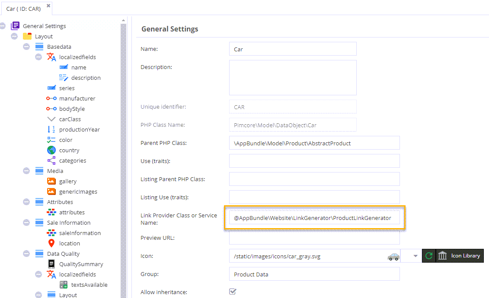
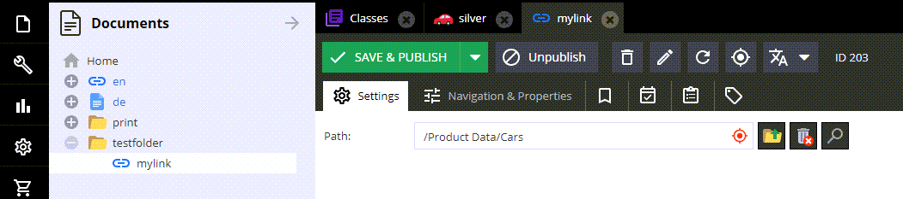

# Link Generator

### Summary

Link Generators dynamically create web links for objects.  
They are automatically invoked when objects are linked in:  
- Document link editables  
- Link document types  
- Object link tags  

Additionally, Link Generators enable the preview tab for data objects.

Link Generators are defined at the class level. There are two ways to specify them:  
- By providing the class name  
- By referencing a Symfony service (using a specific prefix)




```yaml
services:
    # ---------------------------------------------------------
    # Link Generators for DataObjects
    # ---------------------------------------------------------
    App\Website\LinkGenerator\CategoryLinkGenerator:
        public: true

    App\Website\LinkGenerator\ProductLinkGenerator:
        public: true
```

### Sample Link Generator Implementation

```php
<?php

namespace App\Website\LinkGenerator;

use App\Model\Product\AccessoryPart;
use App\Model\Product\Car;
use App\Website\Tool\Text;
use App\Model\ProductInterface;
use OpenDxp\Model\DataObject;
use OpenDxp\Model\DataObject\ClassDefinition\LinkGeneratorInterface;

class ProductLinkGenerator extends AbstractProductLinkGenerator implements LinkGeneratorInterface
{
    public function generate(object $object, array $params = []): string
    {
        if (!($object instanceof Car || $object instanceof AccessoryPart)) {
            throw new \InvalidArgumentException('Given object is no Car');
        }

        return $this->doGenerate($object, $params);
    }

    public function generateWithMockup(ProductInterface $object, array $params = []): string
    {
        return $this->doGenerate($object, $params);
    }

    protected function doGenerate(ProductInterface $object, array $params): string
    {
        return DataObject\Service::useInheritedValues(true, function () use ($object, $params) {
            return $this->OpenDxpUrl->__invoke(
                [
                    'productname' => Text::toUrl($object->getOSName() ? $object->getOSName() : 'product'),
                    'product' => $object->getId(),
                    'path' => $this->getNavigationPath($object->getMainCategory(), $params['rootCategory'] ?? null),
                    'page' => null
                ],
                'product-detail',
                true
            );
        });
    }
}
```

Note: If you want to support mockups or arbitrary objects you can change the typehint to:
```php
    public function generate(object $object, array $params = []): string
    {
        //...
    }
```


The link generator will receive the referenced object and additional data depending on the context.
This would be the document (if embedded in a document), the object if embedded in an object including the tag or field definition as context.

Example:

```php
public function generate(Concrete $object, array $params = []): string
{
    if (isset($params['document']) && $params['document'] instanceof Document) {
        // param contains context information
        $documentPath = $params['document']->getFullPath();
    }
    ...
}
```
 
### Example Document

 
 
 ```php
$d = Document\Link::getById(203);
echo($d->getHref());
```

would produce the following output
 
 ```
 /en/shop/Products/Cars/Sports-Cars/Jaguar-E-Type~p9
 ```
 
 
### Use in Views

#### path() / url()

```twig
<ul class="foo">
    
        <li><a href="{{ path(car) }}">{{ car.getName() }}</a></li>
    
</ul>
```

#### OpenDxpUrl

```twig
<ul class="foo">
    
        <li><a href="{{ path('opendxp_element', {'element': car}) }}">{{ car.getName() }}</a></li>
    
</ul>
```
