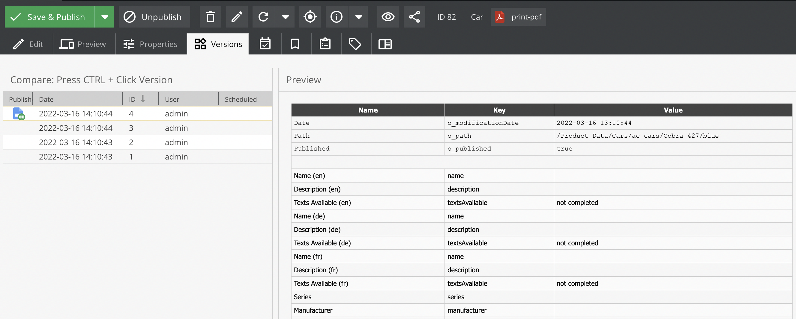
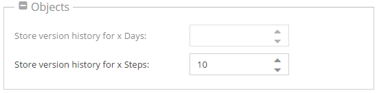

# Versioning

## General
All contents in OpenDXP (documents, assets and objects) are versioned. You can have as many versions as you want.
On each change a new version of the element is created.

For example, if you would like to find the version history in objects you have to choose **Versions** tab.

There you can see a list of changes, what is the difference between revisions and you can choose which version should be published.




## Settings

<div class="inline-imgs">

You can configure the versioning behavior in the  **Settings -> System Settings -> (Documents, Assets, Objects)**

</div>



### Stack trace

OpenDXP generates a stack trace in the db table for each version. You can deactivate this with the following settings:
```yml
opendxp:
    assets:
        versions:
            disable_stack_trace: true
    documents:
        versions:
            disable_stack_trace: true
    objects:
        versions:
            disable_stack_trace: true
```

OpenDXP has a maintenance job (VersionsCleanupStackTraceDbTask) to cleanup stack trace for versions older than 7 days.

## Version storage

For every version the metadata and, if present, binary data is stored. Since the amount of information can turn out to
be too big real quick, OpenDXP provides 3 different ways to handle the storage of version data.

### Configuration

#### Filesystem

*This is the default setting*. 
To store version data in the filesystem, use the `FileSystemStorageAdapter`. 

```yml
OpenDxp\Model\Version\Adapter\VersionStorageAdapterInterface:
    public: true
    alias: OpenDxp\Model\Version\Adapter\FileSystemVersionStorageAdapter

OpenDxp\Model\Version\Adapter\FileSystemVersionStorageAdapter: ~
```
    
#### Database 
To store the version data in a database, use the `DatabaseVersionStorageAdapter` service.
You need to pass a configured doctrine database connection as an argument. 
Therefore, you are able to provide a connection to a completely separate database which may contains only the version data.    

```yml
OpenDxp\Model\Version\Adapter\VersionStorageAdapterInterface:
    public: true
    alias: OpenDxp\Model\Version\Adapter\DatabaseVersionStorageAdapter

OpenDxp\Model\Version\Adapter\DatabaseVersionStorageAdapter:
    arguments:
        $databaseConnection: '@doctrine.dbal.versioning_connection'
```

The database needs to contain a table called `versionsData`. The following script can be used to create the table including the necessary columns.

```sql
CREATE TABLE `versionsData` (
  `id` bigint(20) unsigned NOT NULL AUTO_INCREMENT,
  `cid` int(11) unsigned DEFAULT NULL,
  `ctype` enum('document','asset','object') DEFAULT NULL,
  `metaData` longblob DEFAULT NULL,
  `binaryData` longblob DEFAULT NULL,
  PRIMARY KEY (`id`)
)
```

### Delegate

To store the version data based on a threshold in either the default storage location or a fallback storage location use `DelegateVersionStorageAdapter` service.
If the size of metadata or binary data information exceeds the configured `byteThreshold` value, the version data is stored using the fallback adapter.

```yaml
OpenDxp\Model\Version\Adapter\VersionStorageAdapterInterface:
    public: true
    alias: OpenDxp\Model\Version\Adapter\DelegateVersionStorageAdapter

OpenDxp\Model\Version\Adapter\DelegateVersionStorageAdapter:
    public: true
    arguments:
        $byteThreshold: 1000000
        $defaultAdapter: '@OpenDxp\Model\Version\Adapter\DatabaseVersionStorageAdapter'
        $fallbackAdapter: '@OpenDxp\Model\Version\Adapter\FileSystemVersionStorageAdapter'

OpenDxp\Model\Version\Adapter\FileSystemVersionStorageAdapter: ~

OpenDxp\Model\Version\Adapter\DatabaseVersionStorageAdapter:
    arguments:
        $databaseConnection: '@doctrine.dbal.versioning_connection'
```

In this example the version data is stored in the database as long as neither the metadata nor the binary data exceeds 1000000 bytes in size.
Otherwise, the filesystem is used as storage.

## Turn off Versioning for the Current Process

Sometimes it is very useful to just deactivate versioning for a process. For example for importers or synchronization with 3rd party systems. 
You can globally deactivate and activate the versioning with the following PHP code directly in your scripts:

```php
\OpenDxp\Model\Version::disable(); // to disable versioning for the current process
\OpenDxp\Model\Version::enable(); // to enable versioning for the current process
```

*Note:* With these commands you only deactivate/activate the versioning for the current PHP process. 
This setting is not saved, and only affects changes on elements which are modified within this process! 


## Working with PHP API
When working with PHP API - especially when saving elements - you need to set the `userModification` so that a proper 
user is shown in version history. 

When you set `userModification` to `0` OpenDXP shows `system` as user in the version history. 


```php
$object->setUserModification(0);
$object->save();
```
### Example: How to get a previous version of an object
```php
$versions = $currentObject->getVersions();
$previousVersion = $versions[count($versions)-2];
$previousObject = $previousVersion->getData();
```
