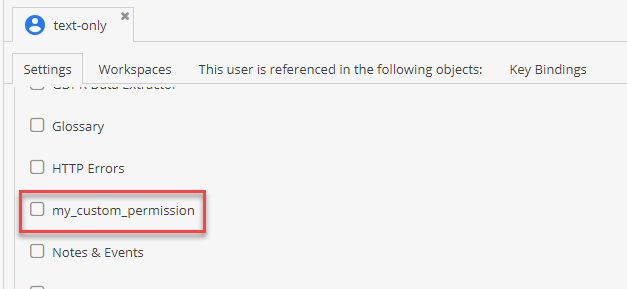

# Add Your Own Permissions

## Add your permission to the database
Choose a custom unique name and add it to the `users_permission_definitions` table in your database.
You should now be able to select the permission in the users/roles tabs:


## Verify the permission

### Inside an AdminController
```php
namespace App\Controller;

use OpenDxp\Controller\UserAwareController;
use OpenDxp\Controller\Traits\JsonHelperTrait;
use Symfony\Component\HttpFoundation\Request;
use Symfony\Component\HttpFoundation\Response;
use Symfony\Component\Routing\Annotation\Route;

class AdminController extends UserAwareController
{
    use JsonHelperTrait;
    /**
     * @Route("/admin/my-admin-action")
     */
    public function myAdminAction(Request $request): Response
    {
        $openDxpUser = $this->getOpenDxpUser();

        if ($openDxpUser?->isAllowed('my_permission')) {
            // ...
        }
        
        return $this->jsonResponse(['success' => true]);
    }
}
```

### In the frontend (bundle)
```js
document.addEventListener(opendxp.events.opendxpReady, (e) => {
    if(opendxp.currentuser.permissions.indexOf("my_permission") >= 0) {
        //...
    }
});
```
