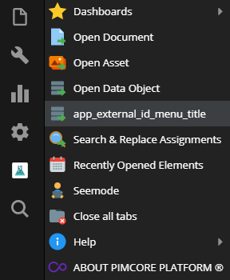
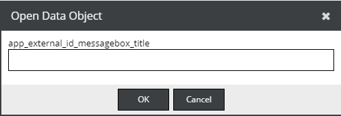

# Open By External Id

There are 2 different approaches:

1) You can either hook directly into the the default OpenDXP id resolver by using [this](/Development_Documentation/Extending_OpenDxp/Event_API_and_Event_Manager.html#page_Hook-into-the-Open-Document-Asset-Data-Object-dialog) event

2) Or add an independent menu entry and a shortcut similar to the default Open Data Object (ctrl + shift + o) to the admin ui.




Create a bundle with a OpenDXP Backend Interface java script extension as described 
[here](../20_Extending_OpenDxp/13_Bundle_Developers_Guide/06_Event_Listener_UI.md). 

```javascript
document.addEventListener(opendxp.events.opendxpReady, (e) => {
    const shortcutKey = 'l';
    const endPoint = '/admin/find-by-external-id';


    const messageBoxTitle = t('app_external_id_messagebox_title');
    const messageBoxText = t('app_external_id_messagebox_errormessage');
    const menuTitle = t('app_external_id_menu_title');


    const openMessageBox = function() {
        Ext.MessageBox.prompt(t("open_data_object"), messageBoxTitle, function(btn, text){
            if(btn == 'ok'){
                Ext.Ajax.request({
                    url: endPoint,
                    method: "post",
                    params: {
                        'external-id': text
                    },
                    success: function(response){
                        var res = Ext.decode(response.responseText);
                        if(res) {
                            opendxp.helpers.openElement(res, 'object');
                        } else{
                            opendxp.helpers.showNotification(t("error"), messageBoxText, "error");
                        }
                    }
                });
            }
        })
    };

    const toolbar = opendxp.globalmanager.get("layout_toolbar");
    const fileMenu = toolbar.fileMenu;
    if(fileMenu) {
        fileMenu.insert(4, {
            text: menuTitle,
            iconCls: 'opendxp_icon_object opendxp_icon_overlay_go',
            cls: 'opendxp_main_menu',
            handler: openMessageBox
        });
    }

    new Ext.util.KeyMap({
        target: document,
        key: shortcutKey,
        fn: openMessageBox,
        ctrl:true,
        alt:false,
        shift:true,
        stopEvent:true
    });

});
```

Create a controller to find your DataObject

```php
namespace App\Controller\Admin;

use Symfony\Component\HttpFoundation\JsonResponse;
use Symfony\Component\HttpFoundation\Request;

class BackendController
{
    /**
     * @Route("/admin/find-by-external-id")
     */
    public function findByWordpressId(Request $request): JsonResponse
    {
        if ($id = $request->query->getInt('external-id')) {
            if($object = MyObject::getByExternalId($id)) {
                return new JsonResponse($object->getId());
            }
        }

        return new JsonResponse(0);
    }
}

```
